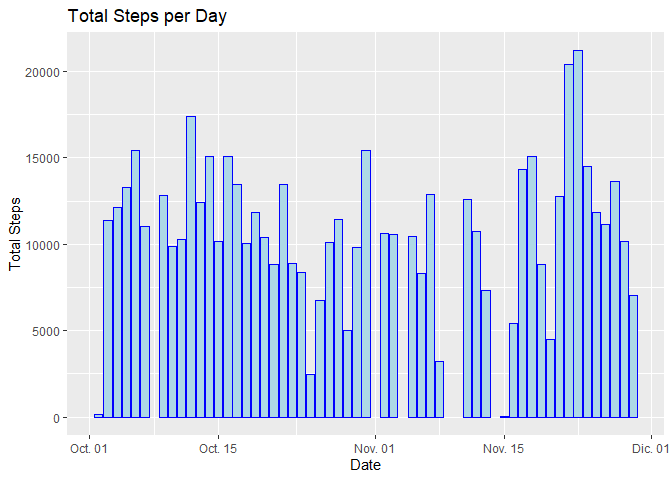
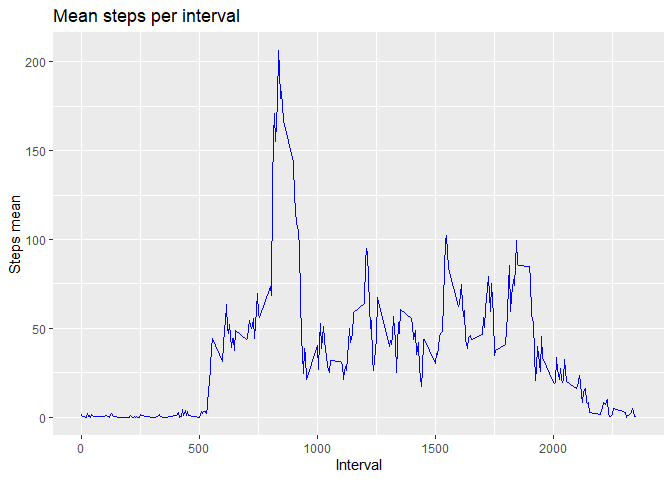
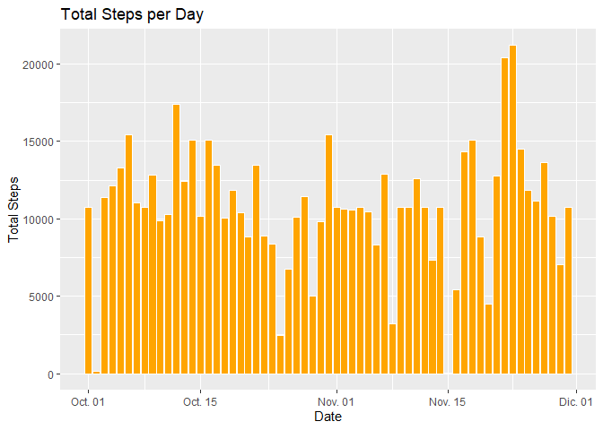
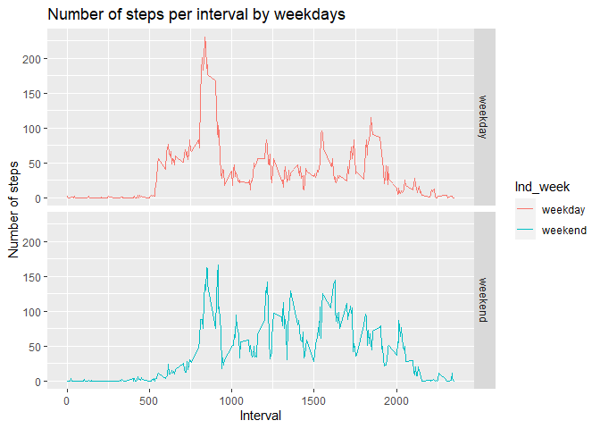

```r
    ##1.- Loading packges and data
    library(lubridate)
    library(dplyr)
    library(ggplot2)
    raw <- read.csv("./activity/activity.csv")
    
    ##2.- Preprocessing data
    data <-  filter(raw, !is.na(steps))
    data <- transform(data, date = ymd(date))
```


## What is mean total number of steps taken per day?


```r
    ##1.- Number of steps by date 
    data_1 <- data %>% 
      group_by(date) %>%
      summarise(totalSteps = sum(steps))
    
    ##2.- Plot
    ggplot(data = data_1, aes(x=date, y=totalSteps))+
      geom_histogram(stat = "identity", fill ="lightblue", col = "blue")+
      labs(title = "Total Steps per Day", x = "Date", y = "Total Steps")
```

<!-- -->

```r
    ##3.- Report
    paste("Mean steps per day: ", round(mean(data_1$totalSteps),0) )
```

```
## [1] "Mean steps per day:  10766"
```

```r
    paste("Median steps per day: ", round(median(data_1$totalSteps),0))
```

```
## [1] "Median steps per day:  10765"
```
   
   
   
## What is the average daily activity pattern? 


```r
     ##1.- Steps mean by interval
    data_2 <- data %>%
      group_by(interval) %>%
      summarise(Steps_mean = mean(steps))
    
    ggplot(data = data_2, aes(x=interval, y=Steps_mean ))+
      geom_line(col = "blue")+
      labs(title = "Mean steps per interval", x = "Interval", y="Steps mean")
```

<!-- -->

```r
    ##2.- Maximun steps on average (interval)
    x1 <- data_2 %>%
      filter(Steps_mean == max(data_2$Steps_mean)) %>%
      select(interval)
    
    paste("The interval with the maximun steps on average: ",x1)
```

```
## [1] "The interval with the maximun steps on average:  835"
```
  
  
   
## Imputing missing values 


```r
    ##1.- Number of missing values
    x2 <- sum(is.na(raw$steps))
    paste("The total number of missing values is: ", x2)
```

```
## [1] "The total number of missing values is:  2304"
```

```r
    ##2.- Replacing NA's values with the interval steps mean
    data_3 <- merge(raw,data_2, by = "interval")
    data_3 <- transform(data_3, date = ymd(date))
    
    data_3[is.na(data_3$steps),2] <- data_3[is.na(data_3$steps),4]   
    
    ##3.- New data frame
    data_3 <- select(data_3, 1:3)
    data_3 <- transform(data_3, date = ymd(date))
    
    ##4.- Plot and report
    data_3_1 <- data_3 %>% group_by(date) %>% summarise(totalSteps = sum(steps))
    
    ggplot(data= data_3_1, aes(x=date, y=totalSteps))+
      geom_histogram(stat = "identity", fill = "orange",col="white")+
      labs(title = "Total Steps per Day", x = "Date", y = "Total Steps")
```

<!-- -->

```r
    paste("Mean steps per day: ", round(mean(data_3_1$totalSteps),0) )
```

```
## [1] "Mean steps per day:  10766"
```

```r
    paste("Median steps per day: ", round(median(data_3_1$totalSteps),0))
```

```
## [1] "Median steps per day:  10766"
```


## Are there differences in activity patterns between weekdays and weekends?


```r
    ##1.- Factor: Weekend and weekdays
    data_4 <- mutate(data_3, Ind_week = factor(weekdays(data_3$date)=="domingo" | weekdays(data_3$date)=="sábado", labels = c("weekday","weekend")))
    
    ##2.- Plot
    data_4 <- data_4 %>%
      group_by(interval,Ind_week) %>%
      summarise(Steps_mean = mean(steps))
    
    ggplot(data = data_4, aes(x=interval,y=Steps_mean, col=Ind_week))+
      geom_line()+
      facet_grid(Ind_week~.)+
      labs(title = "Number of steps per interval by weekdays", x="Interval", y="Number of steps")
```

<!-- -->
    
